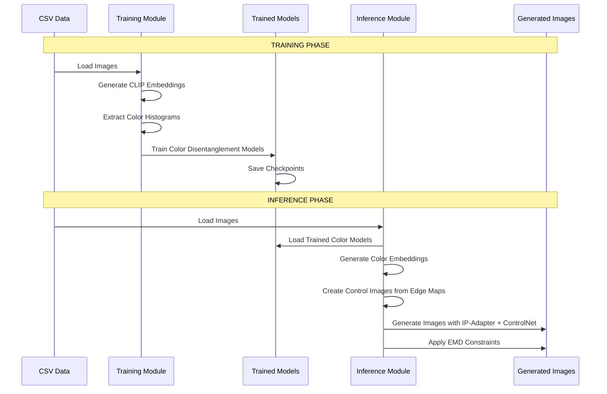

# Training vs Inference Workflow

This diagram shows the complete workflow from training to inference in the DEGIS architecture.

## Key Points

- **Training Phase**: Focuses on learning color disentanglement from CLIP embeddings and color histograms
- **Inference Phase**: Uses trained models to generate images with IP-Adapter and ControlNet
- **Clean Separation**: Training and inference modules are completely independent
- **Shared Components**: Common utilities (config, visualization, etc.) are in the `shared/` folder
